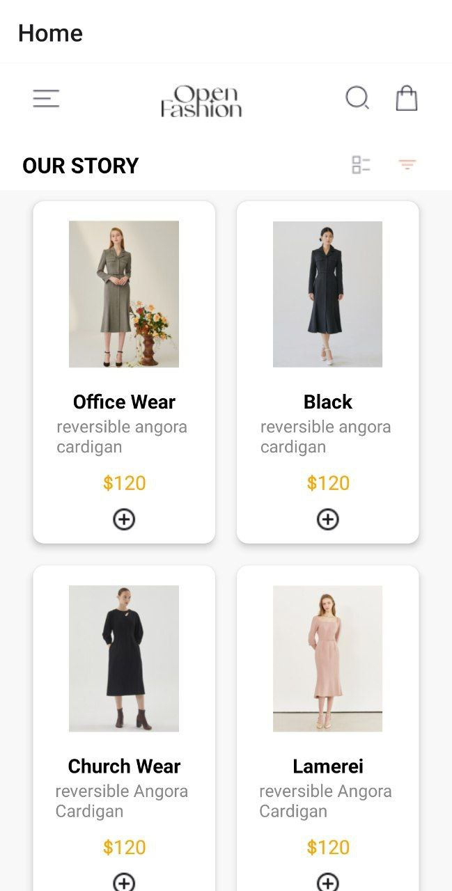

### Student id: 11263775

# ReactAssignment6

## Overview

This project includes a home screen displaying a list of products and a cart screen where users can view and manage the items they have added to their cart. The application uses local storage to save the cart items.

## Features

- Home Screen with a list of products
- Add to Cart functionality
- Cart Screen to view and remove items from the cart
- Persistent storage using AsyncStorage

## Screenshots

